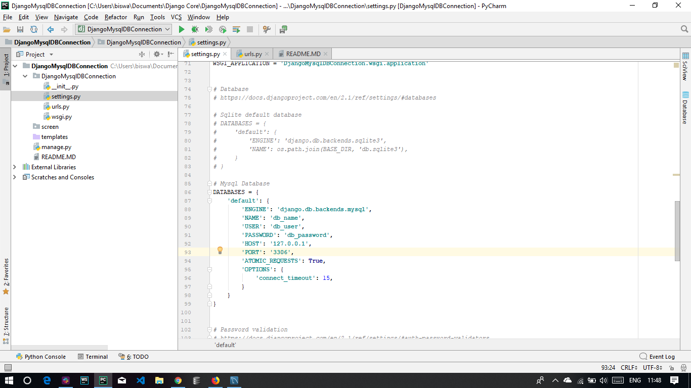

1. Create a new project

2. Activate your environment

3. install ( pip install mysqlclient )

4. Comment the default data base settings and Add Mysql settings

    DATABASES = {
    
    'default': {
    
        'ENGINE': 'django.db.backends.mysql',
        
        'NAME': 'db_name', # Write Your DB Name
        
        'USER': 'db_user', # Write Your User Name
        
        'PASSWORD': 'db_password', # Write Your Password
        
        'HOST': '127.0.0.1',
        
        'PORT': '3306',
        
        'ATOMIC_REQUESTS': True,
        
        'OPTIONS': {
        
            'connect_timeout': 15,
        }
        
    }
    
}

Screen:

